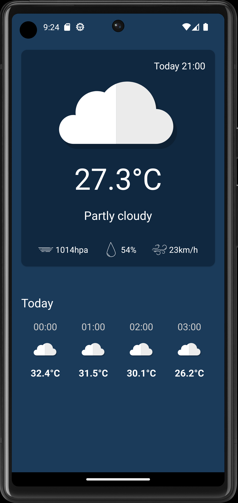

# WeatherApp
This is a simple Weather App. It allows you to check what is the temrature, pressure, humidity and windspeed today. 
The project is written using: Retrofit, Dagger Hilt, Clean Archetecture, MVVM, LocationManeger, Kotlin Coroutines and Compose. 

 
